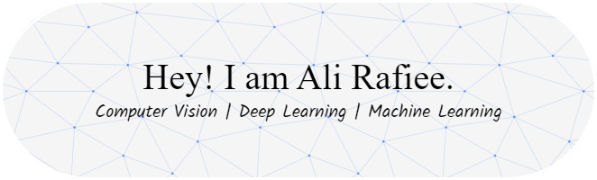

  

👋 Hi, I’m Ahmad Ali Rafiee.  
👀 I’m interested in Computer Vision, Image Processing, Deep Learning, and Machine Learning.   

## My Skills

### Programming Language
 

### Machine Learning and Deep Learning

### IDE and Editor

### Office

### Operating System

## Contact Me
### Where to Find Me

 
 

 
 
 
 

<!--- 
&nbsp;&ensp;&emsp;&ensp;AliRafiee7@gmail.com  
&nbsp;&ensp;&emsp;&ensp;AA.Rafiee@shirazu.ac.ir  
&nbsp;&ensp;&emsp;&ensp;[AliRafiee7](https://linkedin.com/in/alirafiee7)  
&nbsp;&ensp;&emsp;&ensp;[AliRafiee7](https://github.com/AliRafiee7)  
&nbsp;&ensp;&emsp;&ensp;[0000-0002-6413-7925](https://orcid.org/0000-0002-6413-7925)  
&nbsp;&ensp;&emsp;&ensp;[Ahmad-Ali-Rafiee](https://www.researchgate.net/profile/Ahmad-Ali-Rafiee)  

- 🌱 I’m currently learning ...
📫 How to reach me:  
- 💞️ I’m looking to collaborate on ... --->

<!---
alirafiee7/alirafiee7 is a ✨ special ✨ repository because its `README.md` (this file) appears on your GitHub profile.
You can click the Preview link to take a look at your changes.
--->
